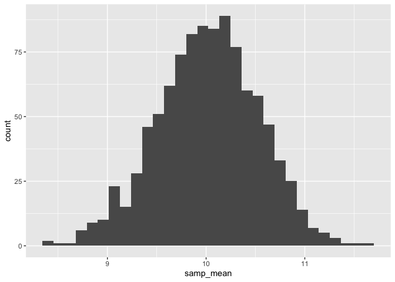
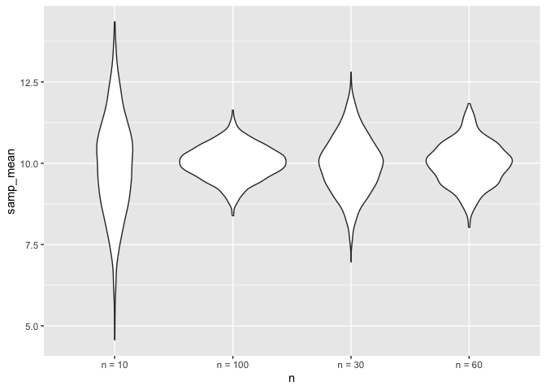
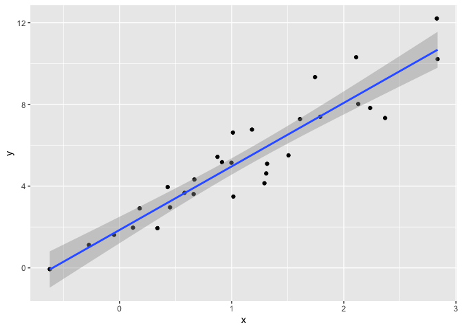
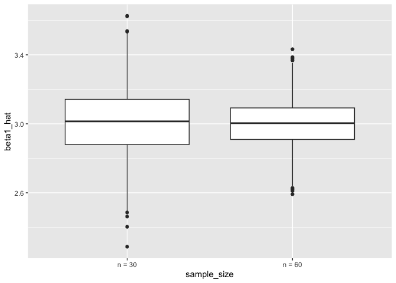
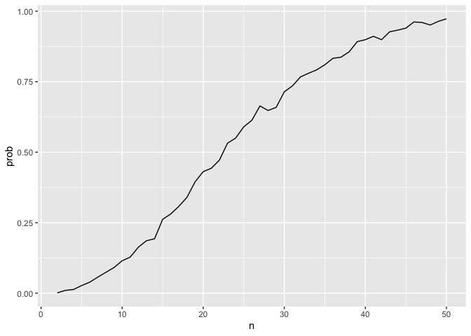

simulation
================
2024-11-02

``` r
library(tidyverse)
```

    ## ── Attaching core tidyverse packages ──────────────────────── tidyverse 2.0.0 ──
    ## ✔ dplyr     1.1.4     ✔ readr     2.1.5
    ## ✔ forcats   1.0.0     ✔ stringr   1.5.1
    ## ✔ ggplot2   3.5.1     ✔ tibble    3.2.1
    ## ✔ lubridate 1.9.3     ✔ tidyr     1.3.1
    ## ✔ purrr     1.0.2     
    ## ── Conflicts ────────────────────────────────────────── tidyverse_conflicts() ──
    ## ✖ dplyr::filter() masks stats::filter()
    ## ✖ dplyr::lag()    masks stats::lag()
    ## ℹ Use the conflicted package (<http://conflicted.r-lib.org/>) to force all conflicts to become errors

``` r
library(rvest)
```

    ## 
    ## Attaching package: 'rvest'
    ## 
    ## The following object is masked from 'package:readr':
    ## 
    ##     guess_encoding

## check stuff using a simulation

``` r
sim_df =
  tibble(
    x = rnorm(30, 10, 5)
  )

sim_df %>% 
  summarize(
    mean = mean(x),
    sd = sd(x)
  )
```

    ## # A tibble: 1 × 2
    ##    mean    sd
    ##   <dbl> <dbl>
    ## 1  9.99  5.55

simulation function to check sample mean and sd

``` r
sim_mean_sd = function(samp_size, true_mean = 10, true_sd = 5) {
  sim_df =
  tibble(
    x = rnorm(samp_size, true_mean, true_sd)
  )

  out_df = 
    sim_df %>%
    summarize(
      samp_mean = mean(x),
      samp_sd = sd(x)
  )
  
  return(out_df)
}
```

run this a lot of times…

``` r
sim_mean_sd(30)
```

    ## # A tibble: 1 × 2
    ##   samp_mean samp_sd
    ##       <dbl>   <dbl>
    ## 1      9.45    6.04

run this using a for loop?

``` r
output = vector("list",1000)

for (i in 1:1000) {
  output[[i]] = sim_mean_sd(30)
  
}

bind_rows(output) %>% 
  summarize(
    ave_samp_mean = mean(samp_mean),
    SE_samp_mean = sd(samp_mean)
  )
```

    ## # A tibble: 1 × 2
    ##   ave_samp_mean SE_samp_mean
    ##           <dbl>        <dbl>
    ## 1          10.0        0.920

use map instead

``` r
sim_result_df = tibble(
  iter = 1:1000
) %>% 
  mutate(samp_res = map(iter , sim_mean_sd, samp_size = 30)) %>% 
  unnest(samp_res)
```

trying different samp sizes…

``` r
sim_res = 
  expand_grid(
    n = c(10, 30, 60, 100),
    iter = 1:1000
  ) %>% 
  mutate(samp_res = map(n, \(x) sim_mean_sd(x, true_mean = 50))) %>% 
  unnest(samp_res)
```

simpler version

``` r
sim_res = 
  expand_grid(
    n = c(10, 30, 60, 100),
    iter = 1:1000
  ) %>% 
  mutate(samp_res = map(n, sim_mean_sd)) %>% 
  unnest(samp_res)
```

``` r
sim_res %>% 
  group_by(n) %>% 
  summarize(
    se = sd(samp_mean)
  )
```

    ## # A tibble: 4 × 2
    ##       n    se
    ##   <dbl> <dbl>
    ## 1    10 1.52 
    ## 2    30 0.881
    ## 3    60 0.655
    ## 4   100 0.512

Plot it

``` r
sim_res %>% 
  filter(n == 100) %>% 
  ggplot(aes(x = samp_mean))+
  geom_histogram()
```

    ## `stat_bin()` using `bins = 30`. Pick better value with `binwidth`.

<!-- -->

``` r
sim_res %>% 
  mutate(
    n = str_c("n = ", n)
  ) %>%
  ggplot(aes(x = n, y = samp_mean))+
  geom_violin()
```

<!-- --> \###
Simple linear regression

``` r
sim_data = 
  tibble(
    x = rnorm(30, mean = 1, sd = 1),
    y = 2 + 3 * x + rnorm(30, 0 ,1)
  )

lm_fit = lm(y ~ x, data = sim_data)

sim_data %>% 
  ggplot(aes(x = x, y = y)) +
  geom_point() +
  stat_smooth(method = "lm")
```

    ## `geom_smooth()` using formula = 'y ~ x'

<!-- -->

let’s turn this into a function

``` r
sim_regression = function(n) {
  sim_data = 
  tibble(
    x = rnorm(n, mean = 1, sd = 1),
    y = 2 + 3 * x + rnorm(n, 0 ,1)
  )
  lm_fit = lm(y ~ x, data = sim_data)
  
  out_df = tibble(
    beta0_hat = coef(lm_fit)[1],
    beta1_hat = coef(lm_fit)[2]
  )
  return(out_df)
}

sim_res = 
  expand_grid(
    sample_size = c(30, 60),
    iter = 1:1000
  ) %>% 
  mutate(lm_res = map(sample_size, sim_regression)) %>% 
  unnest(lm_res)
  
 sim_res %>% 
   mutate(sample_size = str_c("n = ", sample_size)) %>% 
   ggplot(aes(x = sample_size, y = beta1_hat))+
   geom_boxplot()
```

<!-- --> \###
birthday problem let’s put people in a room

``` r
# 365 days, draw 10 days at random, with replacement
bdays = sample(1:365, size = 10, replace = TRUE)

length(unique(bdays)) < 10
```

    ## [1] FALSE

write a function that does this

``` r
bday_sim = function(n) {
  bdays = sample(1:365, size = n, replace = TRUE)

duplicate = length(unique(bdays)) < n

return(duplicate)
}
```

run this a lot

``` r
sim_res = 
  expand_grid(
    n = 2:50,
    iter = 1:1000
  ) %>% 
  mutate(res = map_lgl(n, bday_sim)) %>% 
  group_by(n) %>% 
  summarize(
    prob = mean(res))

sim_res %>% 
  ggplot(aes(x = n, y = prob)) +
  geom_line()
```

<!-- -->
